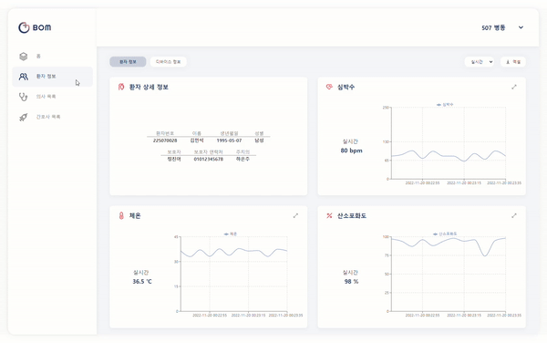
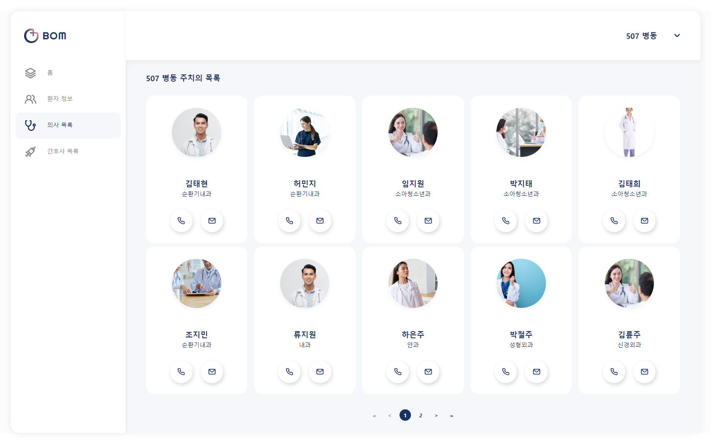
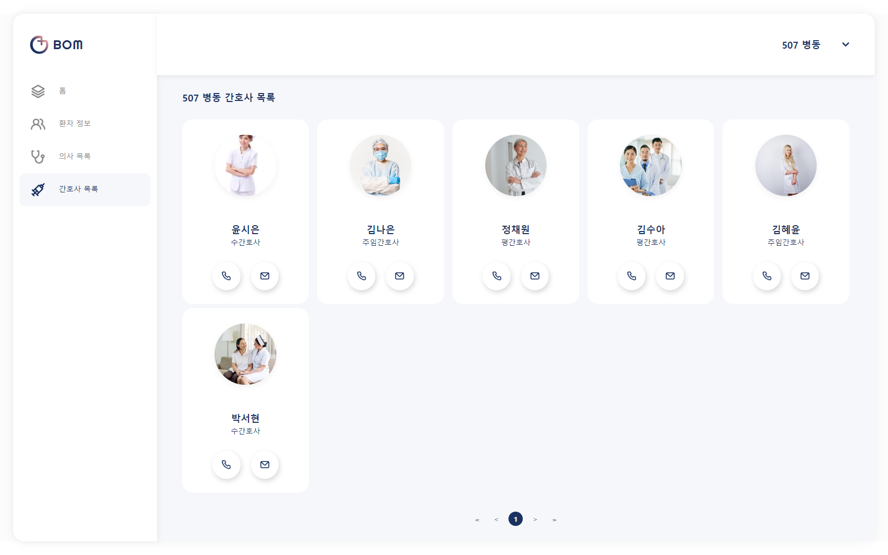
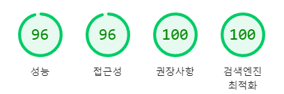
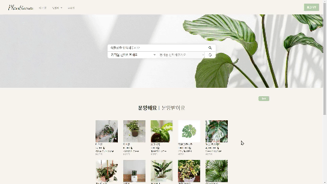

### 문요성 Moonys ⛹️‍♂️

 

#### 안녕하세요, 저는 유저를 바라보고 UX를 향상시키는 프론트 엔드 엔지니어입니다.

 

아무리 획기적인 서비스가 있어도 사용자 접근성이 떨어진다면, 좋은 서비스가 아니라고 생각합니다. 유저 친화적인 UI를 기획하고, 퍼포먼스를 높이는데 집중하는 개발자로 성장해 활약하고 싶습니다.

 

 

---

> 프로젝트 경험

 <b>봄 : BOM 💊</b> 

 

🕖 프로젝트 기간 : 2022.10 ~ 2022.11

🎨 프로젝트 현황 : 개발 완료

💎 삼성 SDI 기업연계 프로젝트

🏆 수상 : SSAFY 자율 PJT 우수상 (2등)

 

BOM은 메디컬 웨어러블 디바이스 및 웹 모니터링 서비스입니다.

디바이스에서 BMS로 배터리 상태를 체크하고 산소포화도 및 온도 센서를 통해 환자의 생체 신호를 수집하빈다.

병동에서는 수집된 데이터들을 시계열로 파악할 수 있고, 엑셀 다운로드를 통해 데이터 분석적 접근을 가능하게 만들었습니다.

코로나 확산으로 인해 일부 병원에서는 지정 보호자 1인을 제외하고 환자 면회가 제한되고 있는데, 환자번호로 로그인하면 가족들도 환자의 상태를 체크할 수 있습니다.

 

담당 직무 : Front-end

참가인원 : 5명

기여도 : BE(0%) | FE(50%)

개발 환경 : React.js , Tailwind CSS , daisy UI

 

구현 사항

- 환자 상세 페이지
  - SPA 기반 환자 정보 페이지
  - 환자의 체온/심박수/산소포화도 확인 가능 및 확대하여 큰 화면으로 조회
  - 버튼 클릭으로 디바이스 BMS 정보 조회
  - 기간 필터링을 통해 특정 기간 데이터 조회 가능
  - 엑셀 다운로드 버튼을 통해 설정한 기간을 기준으로 데이터 다운로드 가능
    
- 의사/간호사 페이지
  - 의사와 간호사의 비상연락망 정보를 확인할 수 있는 페이지
  - 페이지네이션을 통해 요청에 응답한 결과를 렌더링
    
    
- 보호자용 모바일 페이지
  - 환자번호를 통해 로그인할 수 있는 보호자용 로그인 페이지
  - 모바일 사이즈를 설정한 뒤, 해당 크기를 벗어나면 다른 페이지로 이동
    

 

운영

- Lighthouse를 사용해 퍼포먼스 및 웹 페이지 점수 측정 결과 모든 페이지에서 95점 이상의 점수 획득
  

 

기타

- [노션](https://scratch-mail-c09.notion.site/b485f39de68846d98557cbad84b9ac44)
- [Trouble shooting](https://github.com/MoonysKR/TIL/blob/main/BOM_PJT/BOM%20%ED%9A%8C%EA%B3%A0%EB%A1%9D.md)
- [🎬소개영상]()

 

 <b>꽃마리 🌸</b> 

 

🕖 프로젝트 기간 : 2022.09 ~ 2022.10

🎨 프로젝트 현황 : 베타버전 개발 완료

🏆 수상 : SSAFY 특화 PJT 우수상 (2등)

 

꽃마리는 빅데이터 기반 꽃 추천 서비스입니다.

협업 필터링(Collaborative Filtering)과 하이브리드 필터링(Collaborative Filtering & Content Based Filtering)을 사용하여 꽃 이야기과 꽃을 추천해줍니다.

작성한 편지를 OCR로 텍스트를 인식하고 TF-IDF를 기반으로 알맞은 꽃을 추천해줍니다.

 

담당 직무 : Front-end

참가인원 : 6명

기여도 : BE(0%) | FE(33%)

개발 환경 : Next.js , Tailwind CSS , daisy UI

 

구현 사항

- 프로필 페이지
  - SPA 기반 게시글 및 컬렉션에 넣은 꽃을 조회
  - 팔로워와 팔로잉하는 사람들 전체 조회 및 검색
  - 회원정보 수정에서 사진등록 시 미리보기 제공, ID·생년월일·성별 등 유효성 검사 제공
  - [화면정의서](https://a303-princess.notion.site/398602bed88147449753419eb72f7a14)

 

운영

- Head 태그를 작성해 SEO 테스트 점수 100점 달성

 

기타

- [Notion](https://a303-princess.notion.site/a303-princess/97e776287f304c1f8492d1f622f448c7)
- [Trouble shooting](https://github.com/MoonysKR/TIL/blob/main/GGOTMARI_PJT/%EA%BD%83%EB%A7%88%EB%A6%AC%20PJT%20%ED%9A%8C%EA%B3%A0%EB%A1%9D.md)
- [🎬소개영상](https://youtu.be/F-DhYVAxK2E)

 

 <b>PLANTinum 🍀</b> 

 

🕖 프로젝트 기간 : 2022.08 ~ 2022.09

🎨 프로젝트 현황 : 베타버전 개발 완료

🏆 수상 : SSAFY 공통 PJT 우수상 (2등)

 

플랜티넘은 자동화 화분 디바이스 개발 및 식물거래 플랫폼 서비스입니다.

스마트 화분 ‘Supool’과 이를 관리할 수 있는 웹페이지를 제작했고,

식물 거래 플랫폼 ‘잎팔이＇서비스를 구현했습니다.

 

담당 직무 : Front-end

참가인원 : 5명

기여도 : BE(0%) | FE(50%)

개발 환경 : Vue.js 3, Vuex, Bootstrap

 

구현 사항

- 메인페이지
  - 유저의 로그인 상태에 따라 보여주는 화면 전환
- 식물 거래 플랫폼 잎팔이 서비스 구현 담당
  - 식물 검색 및 지역 필터링 모듈화 작업  
    
- 프로필 페이지
  - 주소 찾기 API를 활용해 유저 정보 수정 및 탭 이동으로 작성한 글 조회
    

 

운영

- 이미지 사이즈 , 자바스크립 코드 최적화를 통해 Performance 개선

 

기타

- [Git Branch Convention](PLANTinum/Git%20Branch%20Convention.md)
- [Git Commit Convention](PLANTinum/GIT%20Commit%20Convention.md)
- [JIRA Convention](PLANTinum/JIRA%20Convention.md)
- [Trouble shooting](PLANTinum/Trouble%20shooting.md)
- [🎬소개영상](https://youtu.be/2TLctjGatYQ)
- [🎞시연영상](https://youtu.be/C1uGjrZCowk)

 

 <b>Beesy Movie 🎬</b> 

 

🕖 프로젝트 기간 : 2022.06 ~ 2022.06

🎨 프로젝트 현황 : 베타버전 개발 완료

🏆 수상 : SSAFY 관통 PJT 우수상 (2등)

 

비지무비는 바쁜 현대인을 위한 영화추천 서비스입니다.

Movie Lens에서 수집한 100만 개의 데이터와 TMDB API를 통해 유저에게 맞춤형 영화를 추천해줍니다.

YouTube API를 통해 추천받은 영화의 예고편을 보여주고, 버튼 클릭을 통해 리뷰 영상을 제공하여 영화를 끝까지 감상하기 바쁜 현대인에게 Movie Shorts 서비스를 제공합니다.

 

담당 직무 : Full Stack

참가인원 : 2명

기여도 : BE(30%) | FE(70%)

개발 환경 : Django , SQLite3 , Vue.js 2

 

구현 사항

- Movie Lens 데이터 파일 가공
  - xls파일을 json파일로 변환 및 DB 저장
- Movie Shorts 서비스
  - YouTube API 활용하고, 버튼을 통해 보여주는 값을 변환
- Django model 및 serializer 작성

 

운영

- Vue-meta를 활용하여 SEO 점수 개선

 

---

> 주요 기술 스택 (Tech Stacks)

 | 💛💛💛💛🤍

- 바닐라 자바스크립트를 보고 이해할 수 있음.

 | 💛💛💛💛🤍

- Vuex를 활용해 데이터를 저장하고 적절하게 활용할 수 있음
- 2개의 프로젝트 경험

 | 💛💛💛🤍🤍

- Lifecycle을 이해하고 있고 navigator를 통해 다이나믹 라우터를 구성할 수 있음
- 1개의 프로젝트 진행 중

 | 💛💛💛🤍🤍

- prerender의 개념을 숙지하고 있고, 이에 대한 설정을 지정할 수 있음
- 1개의 프로젝트 경험

 | 💛💛💛🤍🤍

- Python의 기본 문법을 숙지하고 있고, 알고리즘 문제풀이를 주로 진행함

 | 💛💛💛🤍🤍

- MVT패턴을 이해하고 있고, serializer를 사용하여 FE와 통신할 수 있음
- 1개의 프로젝트 경험

 

---

> 학력 및 경력

 <b>학력 🎓</b> 

 

수성고등학교 졸업

- 2013.02

한국외국어대학교 졸업

- 2014.03 ~ 2021. 02
- 주전공 : 노어과 / 부전공 : 경영학

 

 <b>경력 📋</b> 

 

국회 이인영 의원실

**직책**

인턴

**기간**

2020.10.15 ~ 2021.03.07

**담당 업무**

- 논문 (DMZ의 평화적 이용방안) - 우수작 수상
- 책 원고 작성 (2020통일 걷기 : 38선에서 평화의 내일을 걷다)
- 의원실 인스타 및 유튜브 관리

오설록

**부서**

사업기획팀

**직책**

인턴

**기간**

2021.07.01 ~ 2021.07.28

**담당 업무**

- 오설록 사업기획팀2021.07.01 ~ 2021.07.28
- 3개년 매출 분석 및 신제품 판촉 전략 제안
- 일일 매출 보고서 작성 (엑셀)

 

---

> 교육

 <b>성균관대학교 디지털커머스 전문 인력 양성사업</b> 

 

**기간**

2021.09 ~ 2021.12

   

**내용**

성균관대학교 디지털 커머스 과정에서 고객 중심의 상품을 기획하고 실제로 이커머스 시장에서 판매했습니다. 이를 통해 서비스를 제공할 때 고객의 입장에서 기획하고 발전시키는 것이 수익창출로 이어진다는 점을 몸소 체험했습니다.

   

[관련 블로그 링크](https://blog.naver.com/sj871225/222711726798)

  

  

 

 <b>삼성 청년 SW 아카데미</b> 

 

**기간**

2022.01 ~

 

**내용**

삼성 청년 SW 아카데미를 통해 Python, Django 및 HTML, CSS, JS 등을 배웠습니다.

이를 활용하여 IoT, 빅데이터 등 총 4개의 프로젝트를 진행했고 모든 프로젝트에서 수상했습니다.

특히, 마지막 프로젝트는 삼성SDI 기업연계 프로젝트로 최종 결선 발표회에 참여했습니다.

  

  

 
